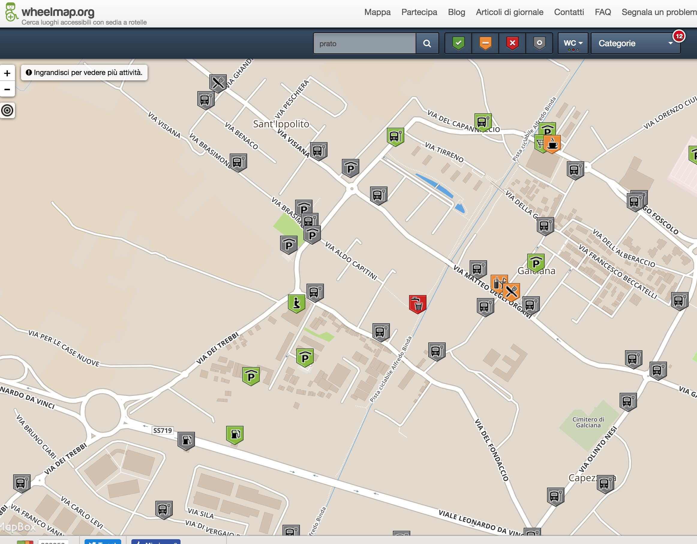

# A scuola di

### Civic Hacking

---

#### Sapere dove sono i luoghi è una ricchezza

---

#### Cosa è?

---

#### E questo?

---

#### E questo?

---

#### Mappiamo la nostra città!

[www.openstreetmap.org](http://www.openstreetmap.org)

---

#### Dov'è l'acqua potabile a Prato?

---

#### Dov'è lo sport a Prato?

---

#### Dove si può andare con la bici?

---

#### Dove si può andare in treno?

---

#### Mappare l'Accessibilità

---

#### Una mappa in tante lingue

---

#### Scusi, dov'è il bagno?

---

#### Mappare per l'emergenza

---
#### Mappare per aiutare la città

---

#### Ora tocca a te!

---

### Grazie
- Matteo Tempestini
- [@il_tempe](https://www.twitter.com/il_tempe)
- [mtempestini@gmail.com](mailto:mtempestini@gmail.com)