# A scuola di

### Civic Hacking

---

#### Sapere dove sono i luoghi è una ricchezza

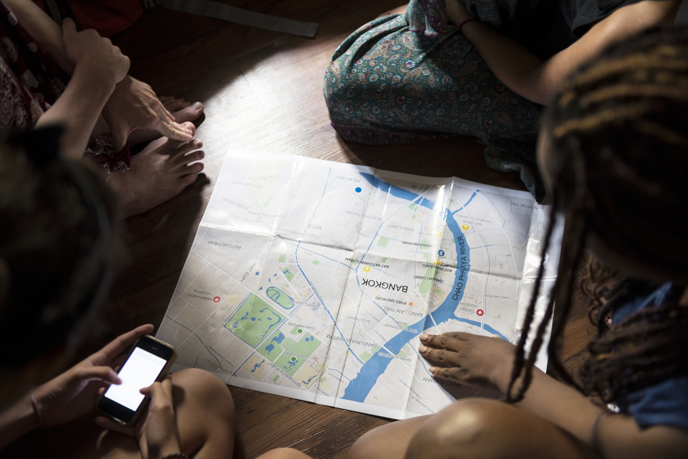

---

#### Cosa è?

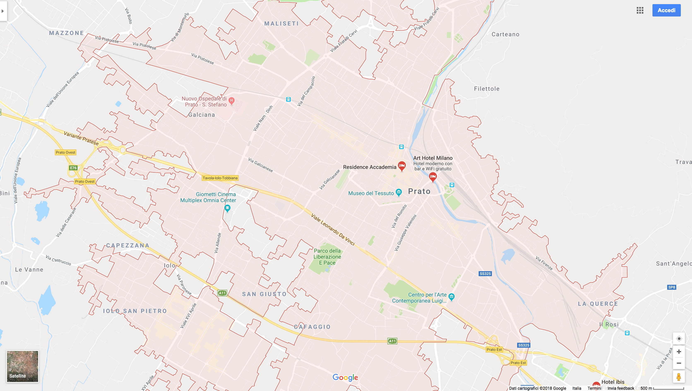

---

#### E questo?

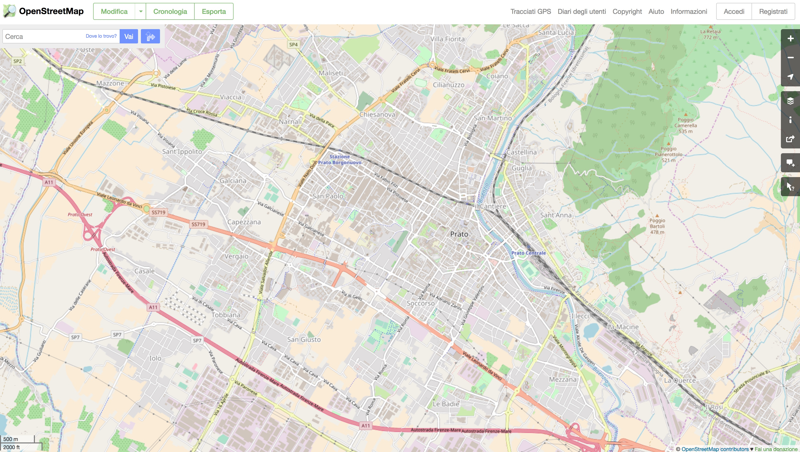

---

#### E questo?

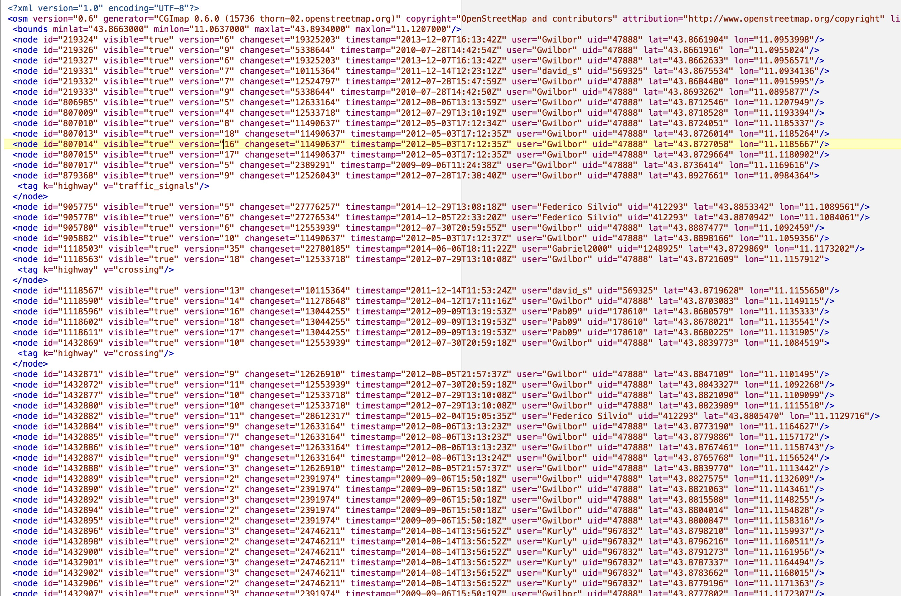

---

#### Mappiamo la nostra città!

[www.openstreetmap.org](http://www.openstreetmap.org)

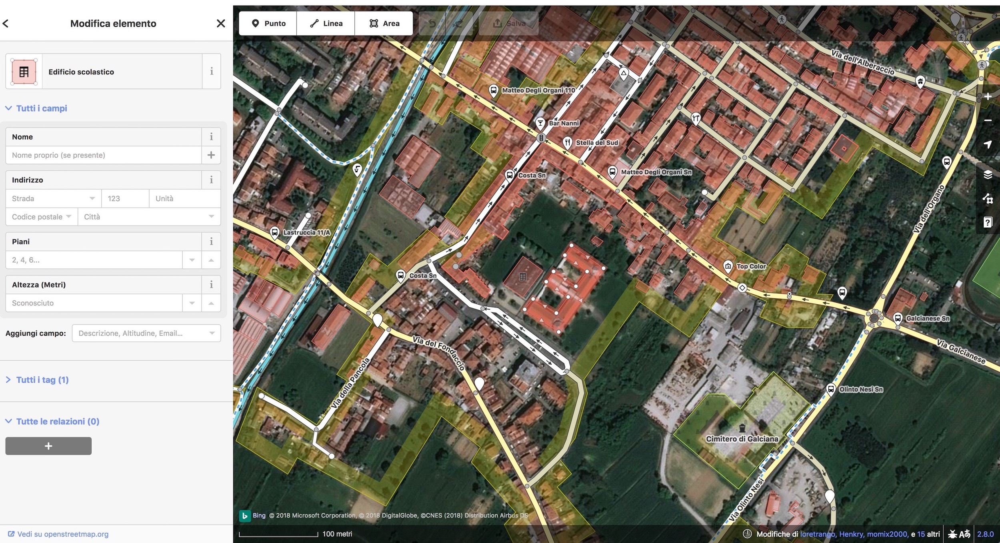

---

#### Tante informazioni da mappare!

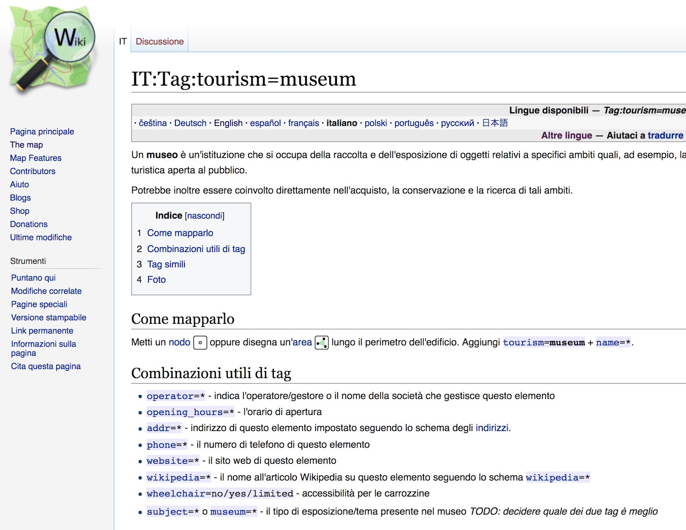

---

#### Dov'è l'acqua potabile a Prato?

---

#### Dov'è lo sport a Prato?

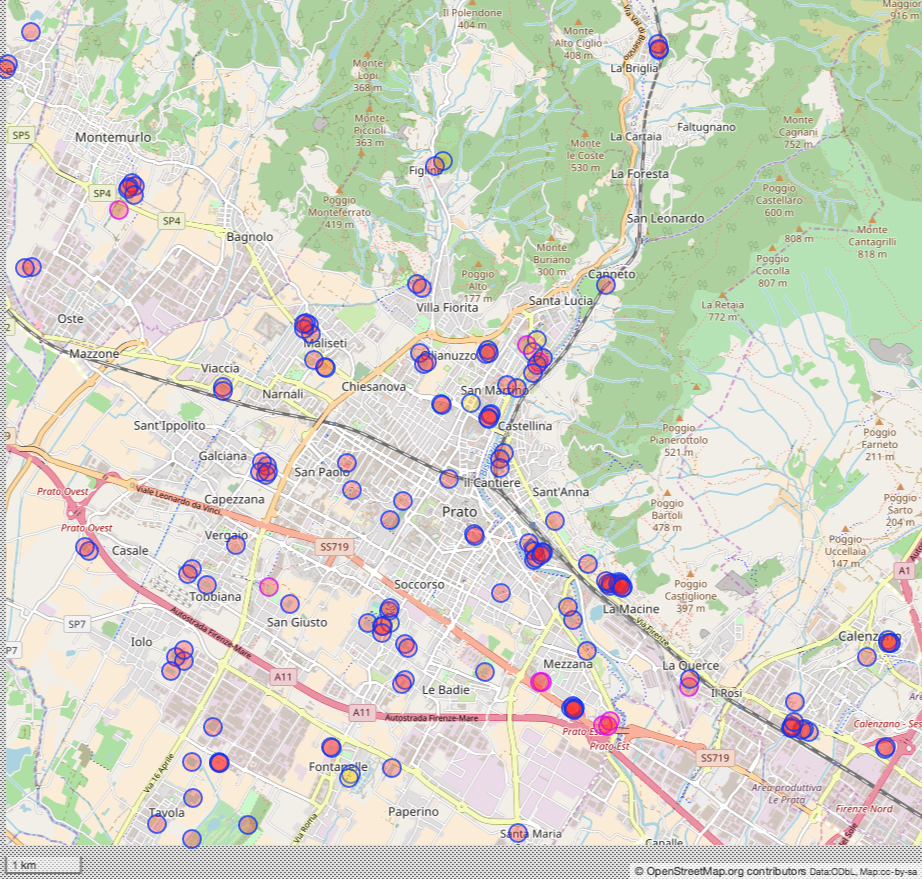

---

#### Dove andare con la bici?

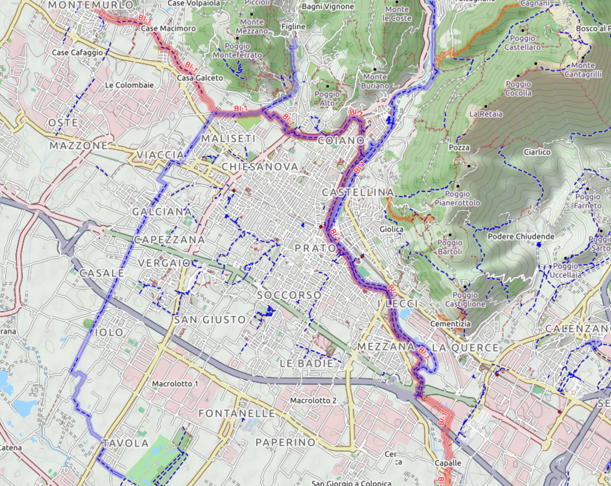

---

#### Dove andare in treno?

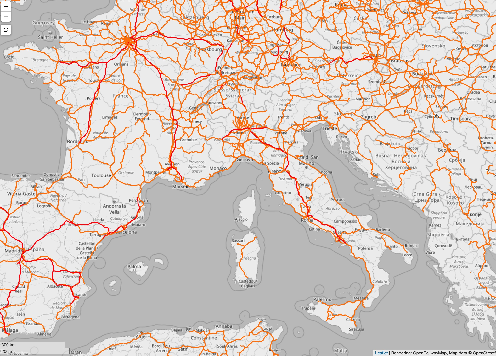

---

#### Mappare l'Accessibilità

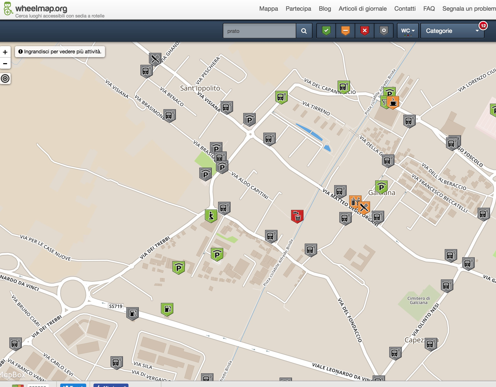

---

#### Mappe in tante lingue

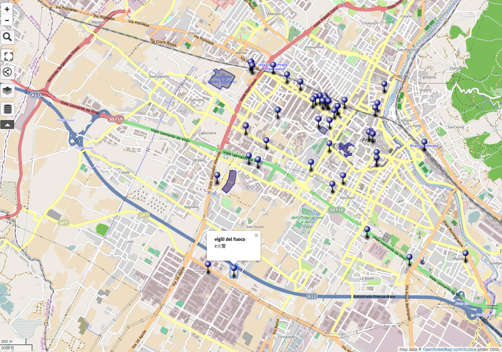

---

#### Scusi, dov'è il bagno?

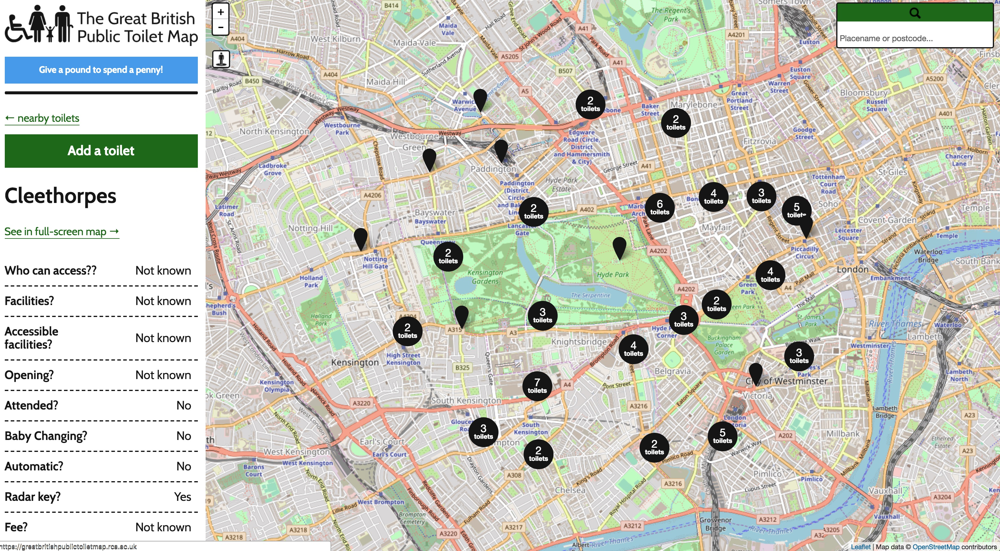

---

#### Mappe per la tua città

---

#### Mappe per l'emergenza

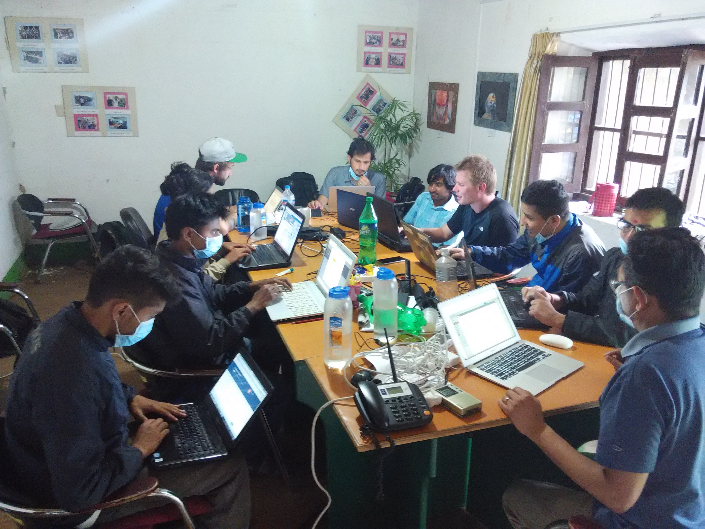

---

#### Mappe per l'emergenza

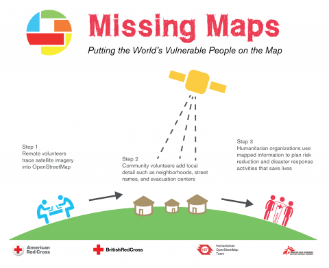

---

#### Far esistere ciò che non esiste

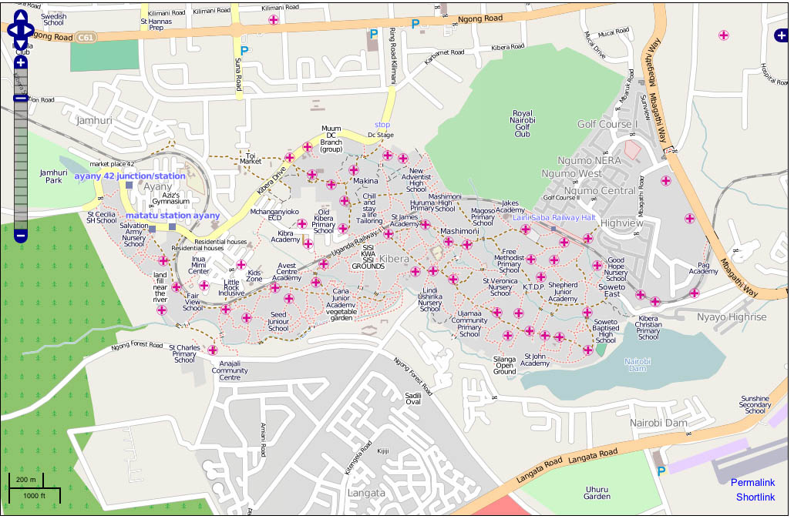
kibera, naerobi, Kenya
---

#### Ora tocca a te!

---

### Grazie
- Matteo Tempestini
- [@il_tempe](https://www.twitter.com/il_tempe)
- [mtempestini@gmail.com](mailto:mtempestini@gmail.com)