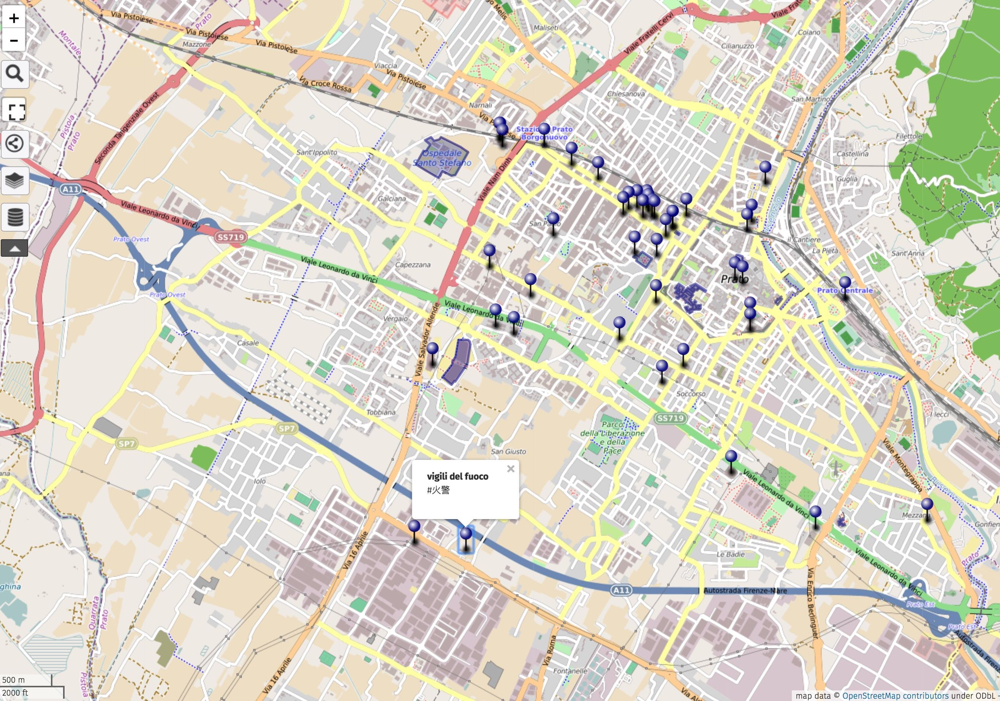
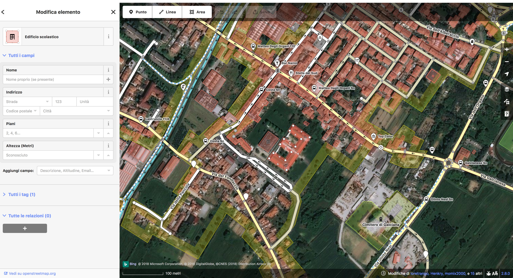
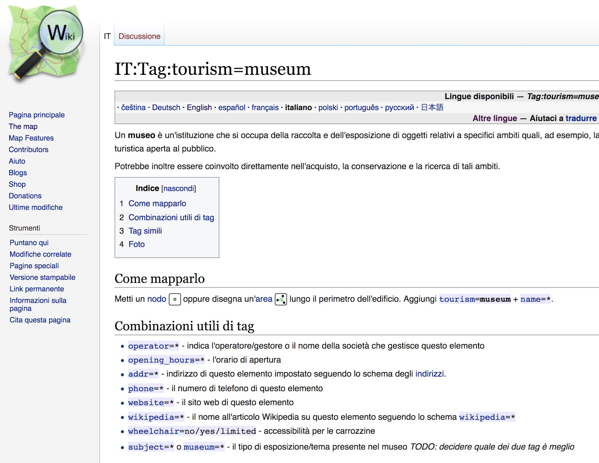
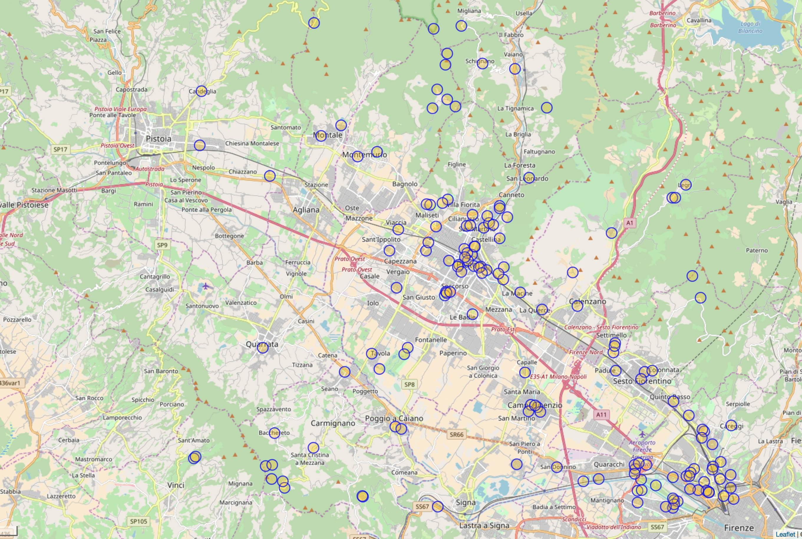
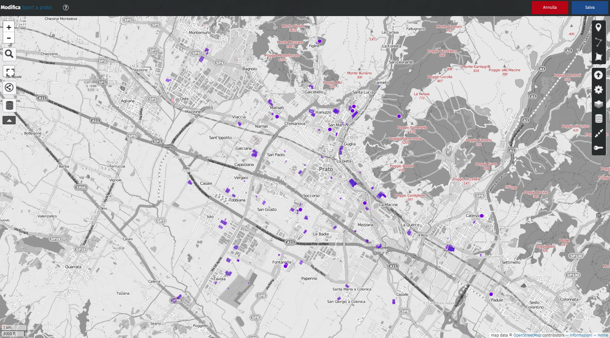
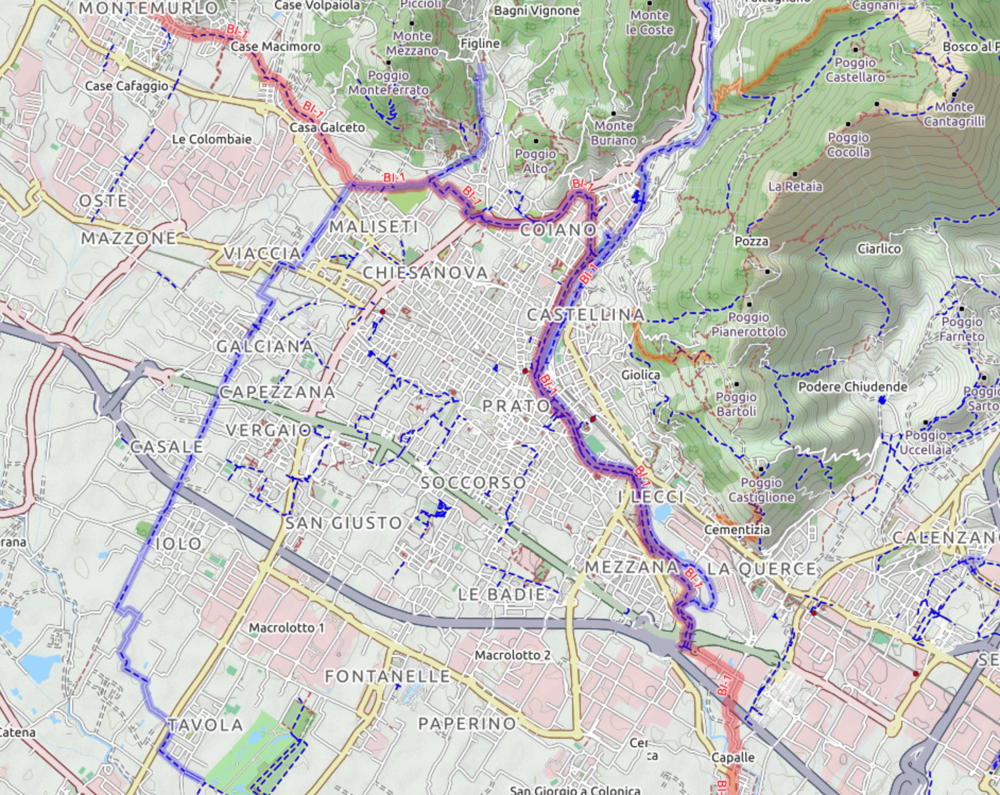
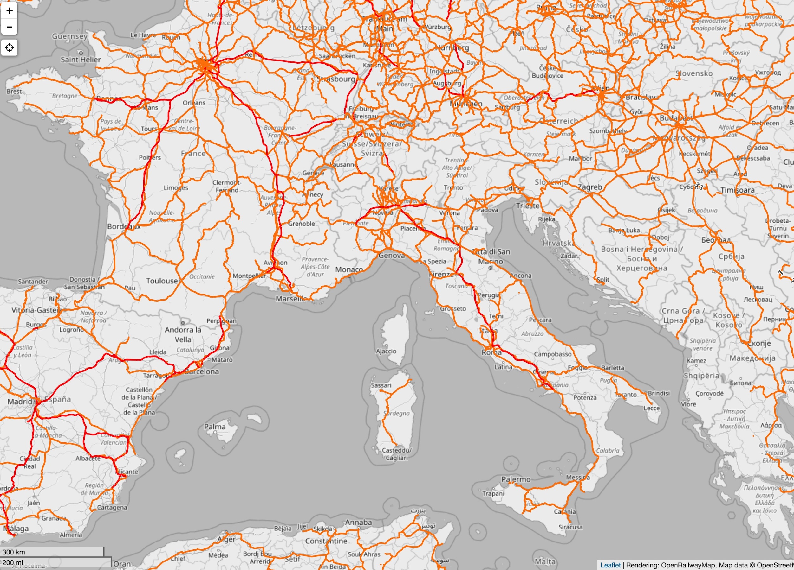
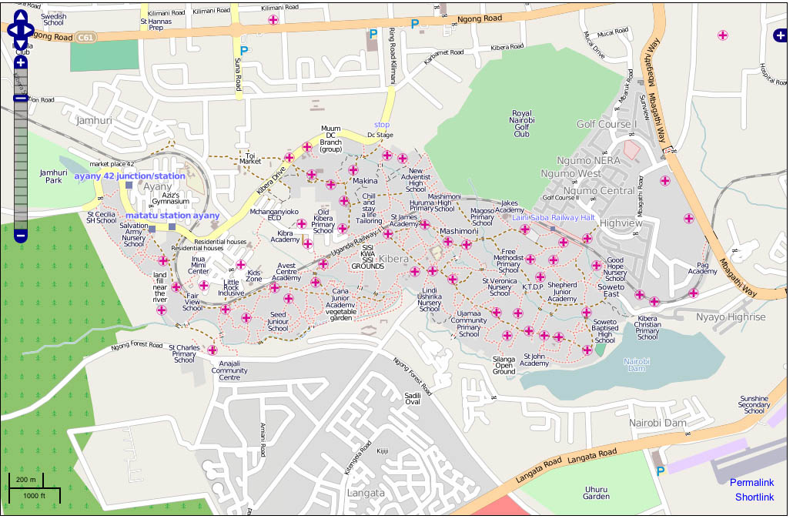
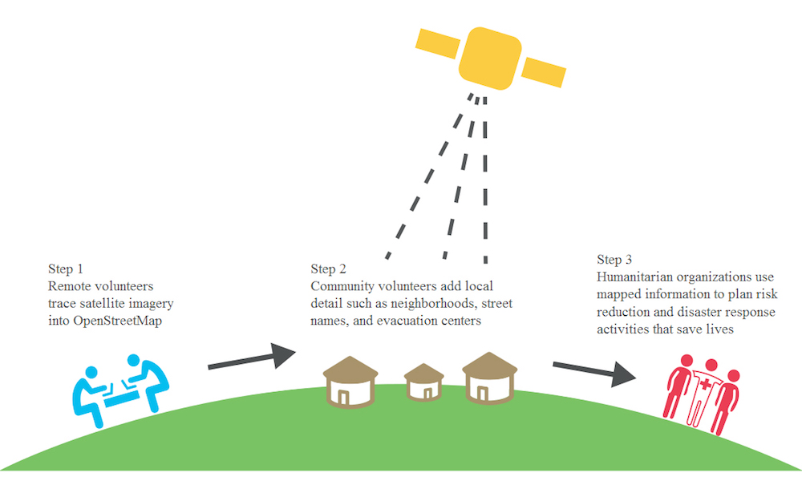

# Il Civic Hacking a Scuola

#### Matteo Tempestini
#### Giornata Regionale dell'Apprendimento Digitale
#### 6 Ottobre 2018

---?image=assets/image/drain1.jpg

---

#### Perchè i Tombini?

[Adopt A Drain](https://adoptadrain.sfwater.org/)

---?image=assets/image/adottauntombino.jpg

---?image=assets/image/wheel.jpeg
---

#### Mappare l'accessibilità?

[WheelMap](https://www.wheelmap.org)

---?image=assets/image/language.jpg

---
#### Creare mappe in tante lingue

---

#### @color[black](Mappare la città)

---

#### Collaborare per mappare informazioni utili a tutti

---

#### Acqua Potabile?

---

#### Sport?

---

#### Bici?

---

#### Treni?

---

#### E così via....

- Ristoranti
- Edifici Abbandonati
- Marciapiedi
- Segnali Stradali
- Panchine
- Alberi Secolari

#### Diventano tutti Dati Pubblici!

---?image=https://raw.githubusercontent.com/iltempe/civichacking_a_scuola/master/workshop/assets/image/pexels-photo-917377.jpeg

---

#### Mappare ciò che non esiste (Kibera,Naerobi,Kenya)

---?image=https://raw.githubusercontent.com/iltempe/civichacking_a_scuola/master/workshop/assets/image/crowdsourcing.jpg
---

#### [Missing Maps](https://www.missingmaps.org/)

---?image=assets/image/tci.jpg
---

## Cosa fa quindi un civic hacker?

@ul

- Si muove davanti ad un problema riguardante la collettività
- Prova ad innescare cambiamento
- Attivismo operando da solo o in gruppo (dal basso!)

@ulend

---

## Qualche strumento

@ul

- Scrivere documentazione in modo condiviso -> [Google Doc](https://www.google.it/intl/it/docs/about/)
- Progettare in modo condiviso -> [Github](https://www.github.com)
- Creare un sito web rapidamente -> [Jekyll](https://jekyllrb.com/)
- Creare ed archiviare dati -> [DataDotWorld](https://data.world/)
- Raccogliere dati sulla geografia -> [Openstreetmap](https://www.openstreet.org)
- Realizzare mappe in modo rapido -> [Umap](https://umap.openstreetmap.fr/it/)
- Condividere fotografie -> [Flickr](https://www.flickr.com/) o [Wikimedia Commons](https://commons.wikimedia.org/wiki/Main_Page)
- Condividere documenti -> [Internet Archive](https://archive.org)

@ulend

---

## Alcuni spunti di discussione

@ul

- Lasciare ai ragazzi la possibilità di sviluppare soluzioni "senza chiedere permesso"
- Promuovere momenti di sviluppo collaborativo (hackathon)
- Sensibilizzare alla produzione di dati utili (smartcity)
- Sensibilizzare alla partecipazione (crowdsourcing)

@ulend

---

#### Ora tocca a te!

---

@ul

- Identifica un problema che ti sta a cuore nella tua città
- Definisci un progetto per poter "fare qualcosa"
- Definisci di quali strumenti hai bisogno

@ulend

---

## Grazie
- Matteo Tempestini
- [@il_tempe](https://www.twitter.com/il_tempe)
- [mtempestini@gmail.com](mailto:mtempestini@gmail.com)