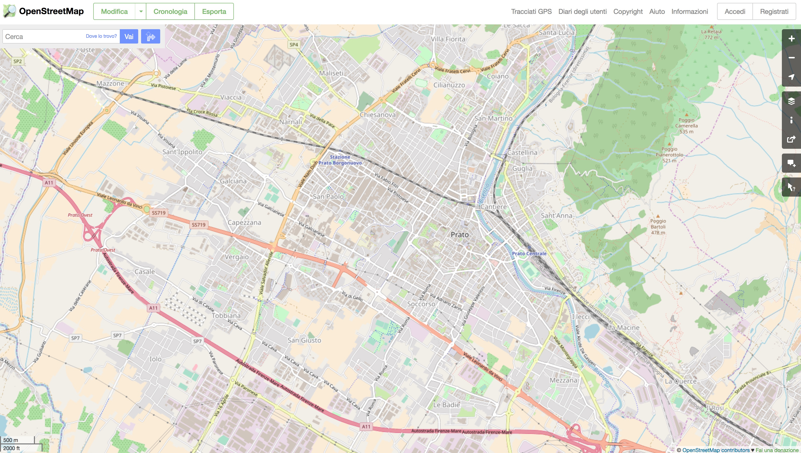
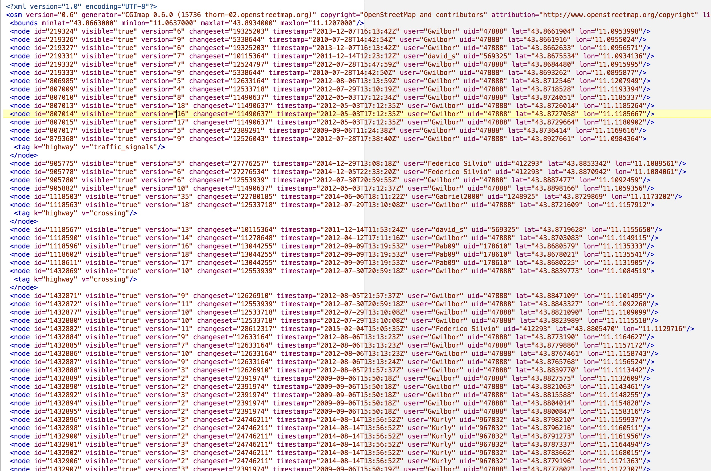
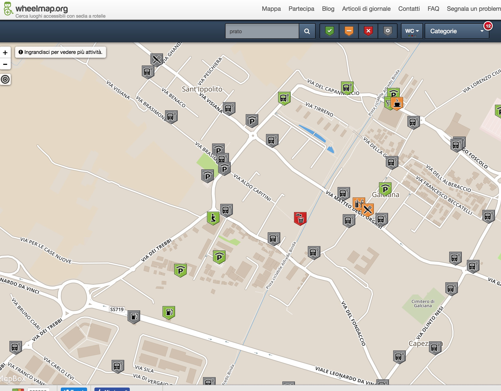
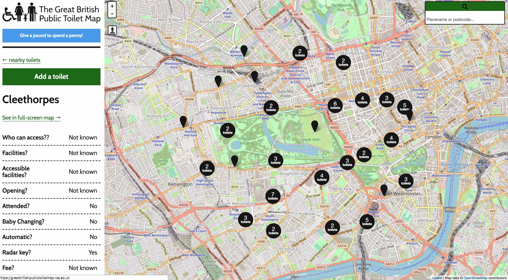
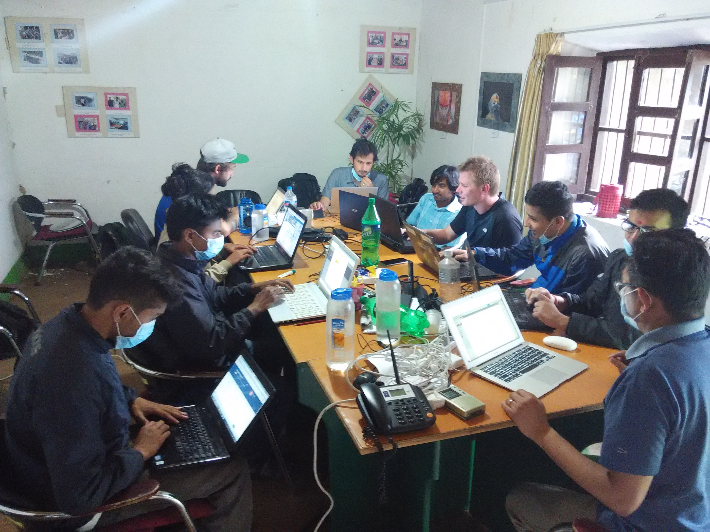

# Il Civic Hacking

# a Scuola

#### Matteo Tempestini
#### Giornata Regionale dell'Apprendimento Digitale
#### Ottobre 2018

---?image=https://upload.wikimedia.org/wikipedia/commons/4/46/Storm_Drain_Dryden.JPG

# @color[white](Avete mai pulito un tombino?)

---

#### Perchè i Tombini?

[Adopt A Drain](https://adoptadrain.sfwater.org/)

---

## Chi è il civic hacker?

@ul

- Prova ad innescare un cambiamento
- Attivista che lavora da solo o in gruppo
- Parte da un problema riguardante la collettività

@ulend

---

#### E questo?

---

#### E questo?

---

#### Mappiamo la nostra città!

[www.openstreetmap.org](http://www.openstreetmap.org)

---

#### Tante informazioni da mappare!

---

#### Dov'è l'acqua potabile a Prato?

---

#### Dov'è lo sport a Prato?

---

#### Dove andare con la bici?

---

#### Dove andare in treno?

---

#### Mappare l'Accessibilità

---

#### Mappe in tante lingue

---

#### Scusi, dov'è il bagno?

---

#### Mappe per la tua città

---

#### Mappe per l'emergenza

---

#### Mappare ciò che non esiste (Kibera,Naerobi,Kenya)

---

#### [Missing Maps](https://www.missingmaps.org/)

---

#### Ora tocca a te!

---

### Grazie
- Matteo Tempestini
- [@il_tempe](https://www.twitter.com/il_tempe)
- [mtempestini@gmail.com](mailto:mtempestini@gmail.com)